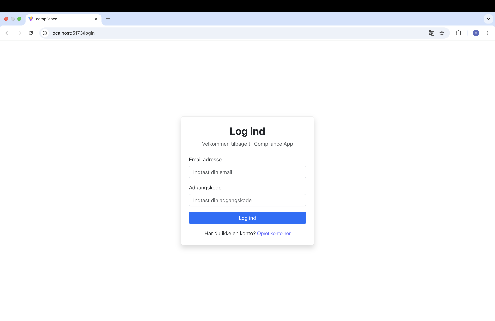
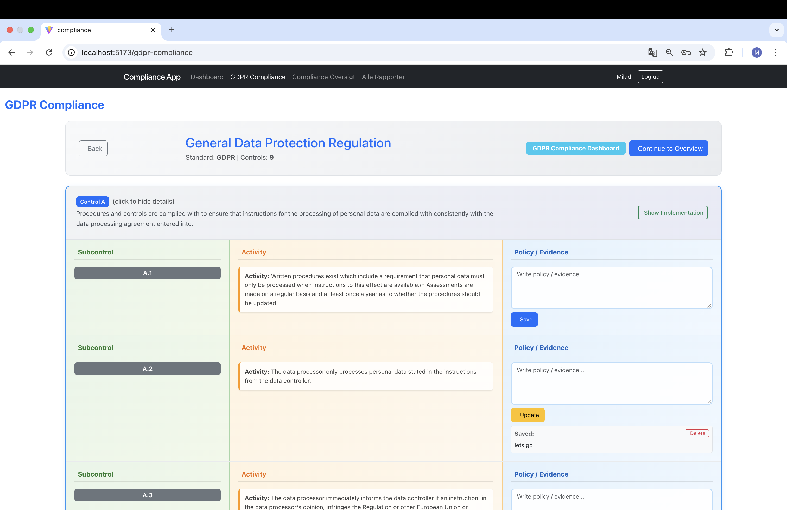
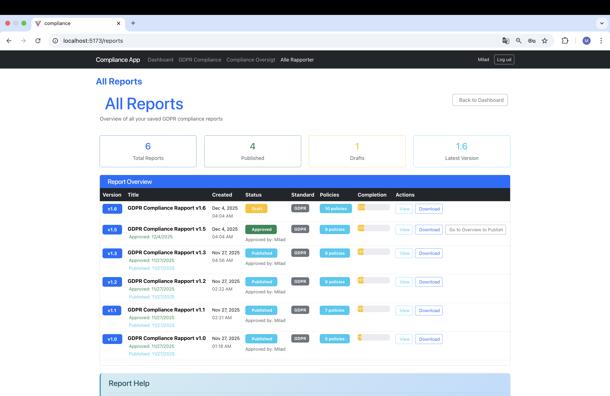
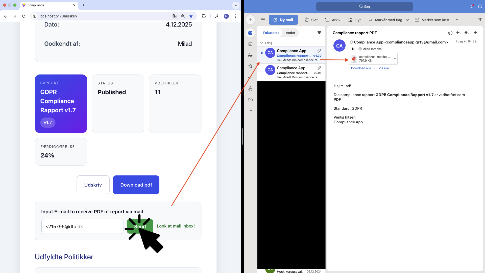

**Compliance Platform – GDPR Workflow System**

A full-stack web application built to simplify GDPR compliance management for auditors and compliance officers.

Instead of navigating hundreds of pages in PDF standards, this platform provides a structured digital workflow where users can manage controls, document policies, track progress, and generate audit-ready reports.

**Highlights**

Built secure authentication with Supabase

Designed a layered architecture (Presentation / Application / Data)

Implemented versioned report generation (Draft → Approved → Published)

Integrated PDF export, print, and email functionality

Developed automated unit and integration tests

Applied design patterns (Observer, Facade, Singleton)

Worked using Scrum with sprint planning and GitHub Projects

**Technical Responsibilities**

React frontend architecture

Authentication flow and protected routing

Policy management logic

Report generation workflow

Testing strategy with Vitest

**Tech Stack**

React · JavaScript · Vite · Supabase · LocalStorage · Vitest

**Outcome**

Delivered a working MVP covering the full workflow:

Login → GDPR Editing → Compliance Overview → Reports → Export

Developed using Scrum and pair programming as part of DTU course 02369.

## Screenshots

### Login Screen

### Register Screen

### Dashboard

### GDPR Dashboard

### Compliance Overview

### Reports Screen

### Print Report

### Download PDF

### Send Email

